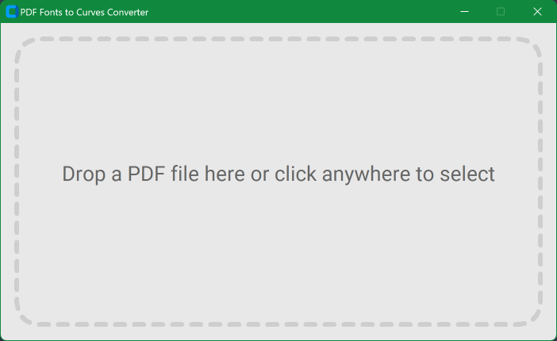

# PDF Fonts to Curves Converter

A single-window desktop application that converts fonts in PDF files to outlines using Ghostscript.



## Download

| Platform | File |
|----------|------|
| Windows  | [PDFtoCurves.exe](dist/PDFtoCurves.exe) (78 MB, GS 10.07.1 bundled) |

The Windows build includes Ghostscript — no separate installation required.

## Usage

1. Open the application
2. Drag & drop a PDF file onto the window (or click to browse)
3. The app creates a `_curves.pdf` file alongside the original

## Building from Source

### Dependencies

```bash
pip install pyinstaller customtkinter Pillow tkinterdnd2
```

### Windows (with GS, recommended)

```bash
# Download and extract portable Ghostscript
python download_gs.py

# Build single-file executable (GS embedded, ~78 MB)
python build_app.py
```

### Windows (without GS, smaller exe)

```bash
# Build without embedded Ghostscript (~14 MB)
# The app will search PATH and common install locations for GS
python build_app.py
```

> **Note:** Without bundled GS, the user must have Ghostscript installed separately,
> or place a portable `gs/` folder next to the exe.

### Linux

```bash
# Install system Ghostscript
sudo apt install ghostscript    # Debian/Ubuntu
sudo dnf install ghostscript    # Fedora

# Build single-file binary
python build_app.py
```

The Linux build uses `gs` from PATH. **Artifex does not provide pre-built Linux
binaries**, so GS cannot be bundled the same way as on Windows. The app will
use the system-installed Ghostscript.

### macOS

```bash
# Install system Ghostscript
brew install ghostscript

# Build single-file binary
python build_app.py
```

Same as Linux — no pre-built macOS binaries from Artifex. The app uses `gs`
from PATH (installed via Homebrew or MacPorts).

### CI/CD (GitHub Actions)

See the [build workflow](.github/workflows/build.yml) example for all three platforms.

## License

AGPL-3.0
